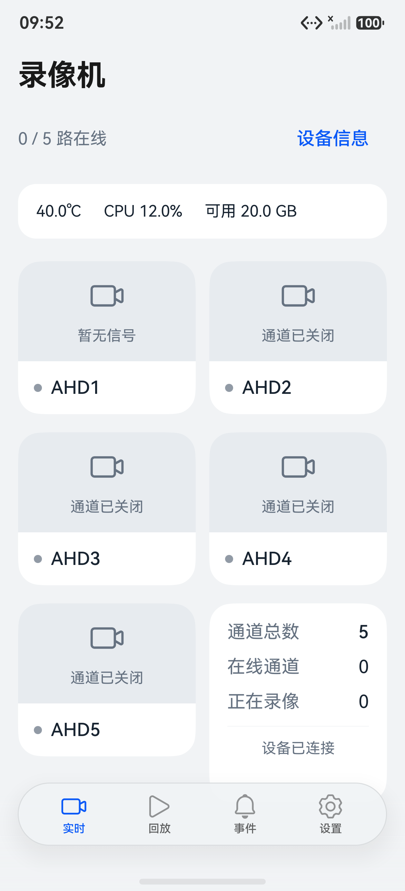
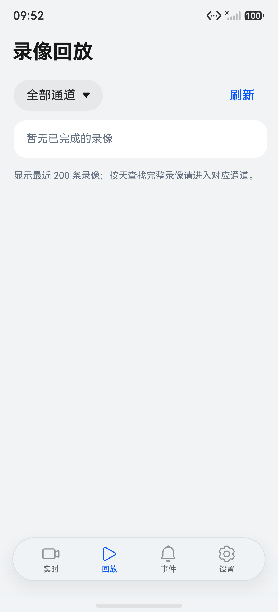
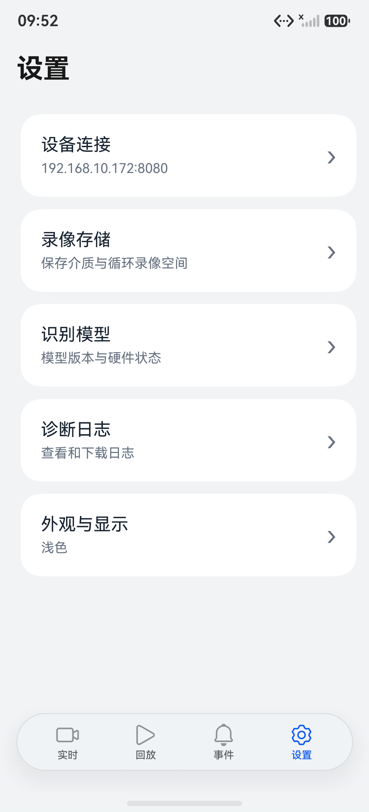

# AiRec 鸿蒙客户端

使用鸿蒙原生界面的智能录像机客户端，支持 **HarmonyOS 6.0 及以上版本**。可在手机和平板上使用，支持横竖屏、浅色和深色界面。

## 界面预览


| 实时画面                                                         | 录像列表                                                               | 设备设置                                                             |
| ------------------------------------------------------------ | ------------------------------------------------------------------ | ---------------------------------------------------------------- |
|  |  |  |

## 主要功能

- 查看五路实时画面和单路全屏。
- 使用垂直时间轴回放当天或指定日期的录像。
- 按人、车、动物和长时间停留筛选事件。
- 查看设备信息、设置摄像头、保存录像和诊断日志。
- 修改连接地址，断网后自动重连。

## 安装与运行

本应用需要配合 **AiRec-Rec 录像机服务**使用。

1. 安装 DevEco Studio 和 HarmonyOS SDK，用 DevEco Studio 打开本仓库文件夹。
2. 等待工程同步完成，选择鸿蒙模拟器或连接自己的鸿蒙设备。
3. 点击运行按钮。真机运行前，需要在 DevEco Studio 中使用自己的开发者账号完成设备注册和自动签名。

工程最低兼容 API 20；当前构建使用 API 26 SDK，已有模拟器验证使用 API 23。尚未完成 API 20 真机验证。

也可以在本仓库文件夹打开 Windows PowerShell，生成 HAP：

```powershell
.\build-hap.ps1
```

默认从 `C:\Program Files\Huawei\DevEco Studio` 查找工具。安装位置不同时执行：

```powershell
.\build-hap.ps1 -DevEcoPath 'D:\Tools\DevEco Studio'
```

输出在 `dist/`。默认生成的 `*-debug-unsigned.hap` 是未签名调试包，不能直接当作通用真机安装包；真机请完成自己的签名后，通过 DevEco Studio 安装。首次准备工具和依赖需要联网。

## 连接录像机

让设备与录像机连接同一局域网，在应用设置中填写录像机地址，例如：

```text
http://192.168.10.172:8080
```

请换成你自己的录像机 IP。连接失败时，先用浏览器打开该地址，确认录像机服务已启动。

## 更多说明

- [文档导航](docs/README.md)

- [构建、签名与安装](docs/BUILD.md)

- [界面设计说明](docs/DESIGN.md)

- [接口说明](docs/CLIENT_API.md)

源码在 `entry/src/`，安装包和日志在 `dist/`。本机配置、缓存和签名文件已设置为不提交到 Git。
